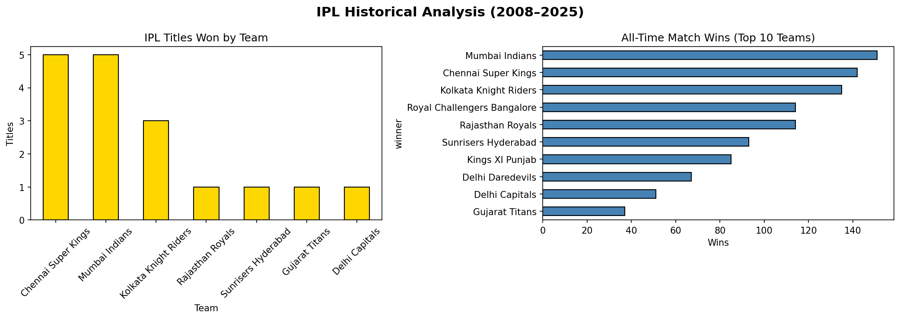
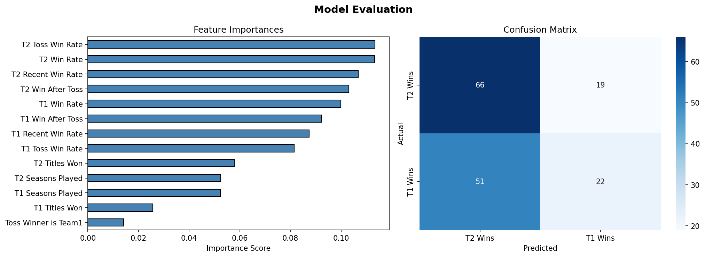
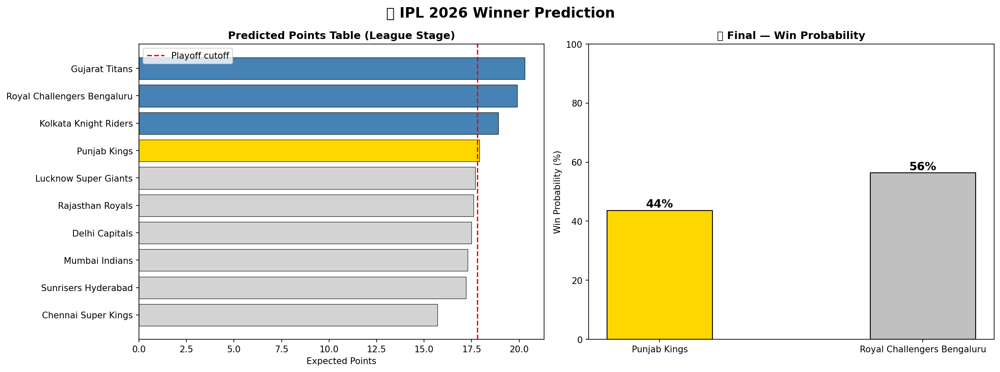

# 🏏 IPL 2026 Winner Predictor

An end-to-end Machine Learning project that predicts IPL match winners and simulates the IPL 2026 season using **XGBoost**, historical ball-by-ball data, and an interactive **Streamlit** dashboard.

---

## 🚀 Live Demo

> Deploy on [Streamlit Cloud](https://streamlit.io/cloud) — free & easy!  
> `streamlit run app.py`

---

## 📸 Screenshots

| EDA & Analysis | Model Evaluation | Season Prediction |
|:-:|:-:|:-:|
|  |  |  |

---

## 🧠 How It Works

The project is structured as a 4-step ML pipeline:

| Step | Script | Description |
|------|--------|-------------|
| 1 | `step1_explore.py` | Load & explore the IPL dataset — season winners, team stats, toss analysis |
| 2 | `step2_features.py` | Feature engineering — team win rates, head-to-head records, venue stats |
| 3 | `step3_train.py` | Train XGBoost model with StratifiedKFold CV & RandomizedSearchCV tuning |
| 4 | `step4_predict.py` | Simulate full IPL 2026 season + playoffs, predict the champion |

The trained model is saved as `ipl_model.pkl` and loaded by the Streamlit app.

---

## ✨ Features

- 🔥 **XGBoost Classifier** — outperforms Random Forest on structured sports data
- 📊 **Head-to-Head Win Rate** as a key feature for better match predictions
- 🏆 **Full Season Simulation** — group stage + playoffs → final prediction
- 🌐 **Live IPL Schedule** integration via API
- 🎨 **Dark IPL Theme** Streamlit UI with custom CSS
- 📈 **Interactive Plotly charts** — win probabilities, team comparisons, and more
- 🤖 **Auto dataset detection** — handles both ball-by-ball and match-level CSV formats

---

## 🛠️ Tech Stack

| Tool | Purpose |
|------|---------|
| Python 3.11 | Core language |
| Pandas / NumPy | Data processing |
| XGBoost | ML model |
| Scikit-learn | Model evaluation & tuning |
| Streamlit | Web dashboard |
| Plotly / Matplotlib / Seaborn | Visualizations |

---

## ⚙️ Installation & Usage

```bash
# 1. Clone the repository
git clone https://github.com/YOUR_USERNAME/ipl-2026-predictor.git
cd ipl-2026-predictor

# 2. Install dependencies
pip install -r requirements.txt

# 3. Add your IPL dataset
# Place IPL.csv (ball-by-ball or match-level) in the project root

# 4. Run the full ML pipeline
python run_all.py

# 5. Launch the Streamlit app
streamlit run app.py
```

---

## 📂 Project Structure

```
ipl_project/
├── app.py                  # Streamlit dashboard (main entry point)
├── data_loader.py          # Smart dataset loader (auto-detects format)
├── step1_explore.py        # EDA & visualization
├── step2_features.py       # Feature engineering
├── step3_train.py          # XGBoost model training & evaluation
├── step4_predict.py        # IPL 2026 season simulation
├── run_all.py              # Run entire pipeline at once
├── ipl_model.pkl           # Pre-trained model
├── training_data.csv       # Engineered features dataset
├── IPL.csv                 # Raw dataset (ball-by-ball)
├── requirements.txt        # Python dependencies
├── assets/logos/           # Team logo images
└── *.png                   # Output visualizations
```

---

## 📊 Dataset

- **Source:** Ball-by-ball IPL data (2008–2025)
- **Size:** ~107 MB, converted to match-level for modelling
- **Features used:** Team win rate, head-to-head record, toss decision, venue, season

---

## 🏅 Model Performance

The XGBoost model is evaluated using:
- **StratifiedKFold Cross-Validation** (5-fold)
- **RandomizedSearchCV** for hyperparameter tuning
- Accuracy metrics on held-out test set

*(See `step3_model_eval.png` for detailed evaluation charts)*

---

## 🤝 Contributing

Pull requests are welcome! For major changes, please open an issue first.

---

## 📄 License

[MIT](LICENSE)

---

## 👨‍💻 Author

Made with ❤️ and cricket passion.  
Connect with me on [LinkedIn](#) | [GitHub](#)
