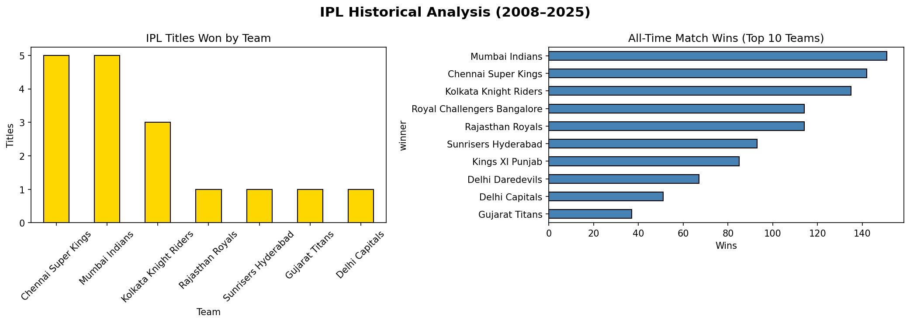
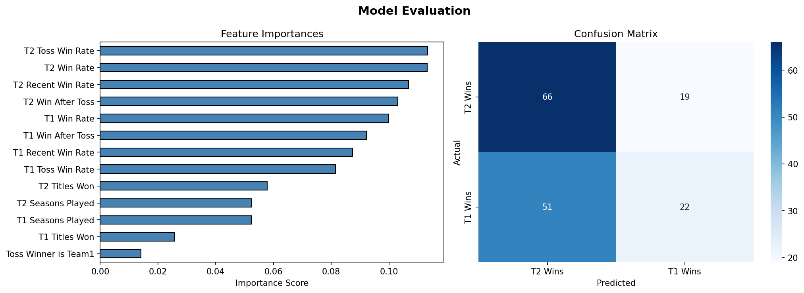
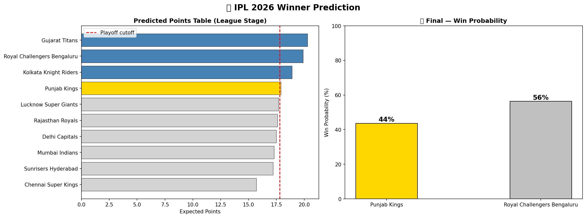

<div align="center">

# 🏏 IPL 2026 Winner Predictor

An end-to-end machine learning project that predicts IPL match winners and simulates
the full **IPL 2026 season** — group stage through playoffs to the champion — using
**XGBoost**, historical ball-by-ball data (2008–2025), and an interactive
**Streamlit** dashboard.

[](#)
[](#)
[](#)
[](#)
[](#-license)

[Features](#-features) • [How It Works](#-how-it-works) • [Setup](#%EF%B8%8F-installation--usage) • [Dataset](#-dataset) • [Performance](#-model-performance)

</div>

---

## 📌 Overview

Every IPL season, fans argue over who's going to win — this project turns that
argument into a data pipeline. It ingests over 15 seasons of ball-by-ball IPL data,
engineers match-level features (team form, head-to-head history, venue and toss
effects), trains an XGBoost classifier to predict match outcomes, and then runs that
model forward through an entire simulated IPL 2026 season to predict a champion.

The whole thing is wrapped in a Streamlit dashboard with a dark IPL-themed UI, so the
predictions aren't just numbers in a terminal — they're something you can actually
click through.

---

## 🚀 Live Demo

```bash
streamlit run app.py
```

Or deploy it for free on [Streamlit Community Cloud]([https://streamlit.io/cloud](https://tusharmagar1-ipl-2026-predictor-app-fzaytx.streamlit.app/) —
point it at `app.py` and it's live in a couple of minutes.

> *(Add your deployed Streamlit Cloud link here once it's live, e.g.
> `https://ipl-2026-predictor.streamlit.app`)*

---

## 📸 Screenshots

| EDA & Analysis | Model Evaluation | Season Prediction |
|:---:|:---:|:---:|
|  |  |  |

---

## ✨ Features

- 🔥 **XGBoost classifier** — outperforms Random Forest on structured, tabular sports data
- 📊 **Head-to-head win rate** as a key engineered feature for sharper match predictions
- 🏆 **Full season simulation** — group stage → playoffs → final, predicting the champion end-to-end
- 🌐 **Live IPL schedule integration** via API
- 🎨 **Dark IPL-themed Streamlit UI** with custom CSS
- 📈 **Interactive Plotly charts** — win probabilities, team comparisons, and more
- 🤖 **Auto dataset detection** — handles both ball-by-ball and match-level CSV formats

---

## 🧠 How It Works

The project is structured as a clean 4-step ML pipeline, so each stage can be run,
inspected, and debugged independently:

| Step | Script | Description |
|---|---|---|
| 1 | `step1_explore.py` | Load & explore the IPL dataset — season winners, team stats, toss analysis |
| 2 | `step2_features.py` | Feature engineering — team win rates, head-to-head records, venue stats |
| 3 | `step3_train.py` | Train the XGBoost model with `StratifiedKFold` cross-validation & `RandomizedSearchCV` tuning |
| 4 | `step4_predict.py` | Simulate the full IPL 2026 season + playoffs and predict the champion |

The trained model is serialized as `ipl_model.pkl` and loaded directly by the
Streamlit app for inference — no retraining needed to serve predictions.

**Data flow:** `IPL.csv` (raw ball-by-ball) → `data_loader.py` (auto-detects
format) → feature engineering → `ipl_model.pkl` → `app.py` renders predictions,
win probabilities, and the simulated season bracket.

---

## 🛠 Tech Stack

| Tool | Purpose |
|---|---|
| Python 3.11 | Core language |
| Pandas / NumPy | Data processing |
| XGBoost | Match-outcome prediction model |
| Scikit-learn | Model evaluation & hyperparameter tuning |
| Streamlit | Interactive web dashboard |
| Plotly / Matplotlib / Seaborn | Visualizations |

---

## ⚙️ Installation & Usage

```bash
# 1. Clone the repository
git clone https://github.com/tusharmagar1/ipl-2026-predictor.git
cd ipl-2026-predictor

# 2. Install dependencies
pip install -r requirements.txt

# 3. Add your IPL dataset
# Place IPL.csv (ball-by-ball or match-level) in the project root

# 4. Run the full ML pipeline
python run_all.py

# 5. Launch the Streamlit app
streamlit run app.py
```

---

## 📂 Project Structure

```
ipl_project/
├── app.py                  # Streamlit dashboard (main entry point)
├── data_loader.py          # Smart dataset loader (auto-detects format)
├── step1_explore.py        # EDA & visualization
├── step2_features.py       # Feature engineering
├── step3_train.py          # XGBoost model training & evaluation
├── step4_predict.py        # IPL 2026 season simulation
├── run_all.py               # Run entire pipeline at once
├── ipl_model.pkl            # Pre-trained model
├── training_data.csv        # Engineered features dataset
├── IPL.csv                  # Raw dataset (ball-by-ball)
├── requirements.txt         # Python dependencies
├── assets/logos/             # Team logo images
└── *.png                     # Output visualizations
```

---

## 📊 Dataset

- **Source:** Ball-by-ball IPL data (2008–2025)
- **Size:** ~107 MB, converted to match-level format for modelling
- **Features used:** Team win rate, head-to-head record, toss decision, venue, season

---

## 🏅 Model Performance

The XGBoost model is evaluated using:

- **StratifiedKFold cross-validation** (5-fold)
- **RandomizedSearchCV** for hyperparameter tuning
- Accuracy metrics on a held-out test set

See `step3_model_eval.png` for the detailed evaluation charts (confusion matrix,
feature importance, and CV score distribution).

---

## ⚠️ Known limitations

- Predictions are only as good as historical patterns — IPL squads change every
  season (auctions, trades, injuries), which the model can't account for beyond
  what's captured in team-level win-rate features.
- Toss and venue effects are included as features but are inherently noisy signals
  in T20 cricket.
- The full-season simulation assumes the published IPL 2026 schedule; changes to
  fixtures after training will require re-running `step4_predict.py`.

## 🗺 Possible extensions

- Add player-level features (current form, injuries, auction changes) instead of
  team-level aggregates only
- Experiment with ensemble methods (XGBoost + LightGBM) for the win-probability model
- Add a live-updating leaderboard that re-simulates remaining fixtures after each
  actual match result

---

## 🤝 Contributing

Pull requests are welcome! For major changes, please open an issue first to discuss
what you'd like to change.

---

## 📄 License

This project is licensed under the [MIT License](LICENSE) — feel free to use,
modify, and build on it.

---

## 👤 Author

**Tushar Magar**

Made with ❤️ and cricket passion.

- GitHub: [@tusharmagar1](https://github.com/tusharmagar1)
- LinkedIn: [tushar-magar](https://www.linkedin.com/in/tushar-magar-7b80a2255)

If you found this project interesting, a ⭐ on the repo is always appreciated!
